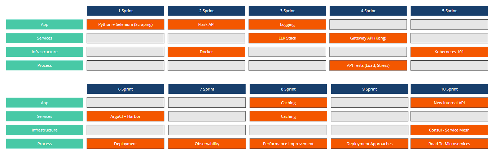

# Hyped-API

Hey everyone, every now and then I start a new project to learn or practice some tool. This time I'll try something different. I'm planning to create an API from the ground using all the tools that I want to learn, going through the process of getting the API from the first commit to publish it as a real product.

I'll create bi-weekly posts with:
- Updates of the project
- What I'm working on.
- Why I'm using these tool.
- How these tools works

If you know about a  bleeding edge tool that we could work with, send me a message and I'll be glad to take a look and give a try.

Ok, so how it gonna work?
I've created a planning for the first 10 sprints. A sprint won't have an exact time frame since I'm planning to work on that only 5h/week and some of these tools will probably require different effort to really understand how it works. But even that a sprint could take a month, I'll make bi-weekly reports so you can follow the project.

<b>Sprint 1:</b>
- Scraping data with Selenium + Python. :heavy_check_mark:

<b>Sprint 2:</b> 
- Starting the Flask API :heavy_check_mark:
- Why containerize our application, and how?

<b>Sprint 3:</b>
- ELK Stack as platform for Logs, Metrics, APM, Uptime and more!
- Add meaningful logs to our app.

<b>Sprint 4:</b>
- Why using a Gateway API?
- Kong as our Gateway API.
- Integrating Kong with ELK Stack.
- Is our API working? Tests, tests, tests... 

<b>Sprint 5:</b>
- Kubernetes 101 (Maybe ECS 101)
	- Create a local cluster
	- First Steps
	- Services
	- Resources
	- Taints
	- Deployment
	- Label
	- Node Selector
	- ReplicaSet
	- DaemonSet
	- Rollout
	- Rollback
	- Canary Deployment
	- Persistent Volume
	- CronJobs
	- Secrets
	- ConfigMaps
	- InitContainers
	- RBAC
	- Helm
	- Ingress Controller
	- Cert-Manager

<b>Sprint 6:</b>
- Pushing our Docker images to Harbor.
- Argo CI as our deployment tool.
- Deploying our API on Kubernetes.

<b>Sprint 7:</b>
- Improve the observability.

<b>Sprint 8:</b>
- Performance Improvement
- Caching
	- Redis

<b>Sprint 9:</b>
- Deployment Approaches
	- Blue-Green Deployment
	- Canary Release

<b>Sprint 10:</b>
- New Internal API
- Service Mesh to the rescue... or not!

In parallel with all this fun stuff I would like to talk more about other stuff:

- Availability
- Latency
- Performance
- Efficiency
- Change Management
- Emergency Response
- Incident Response
- Preparation
- Capacity Planning